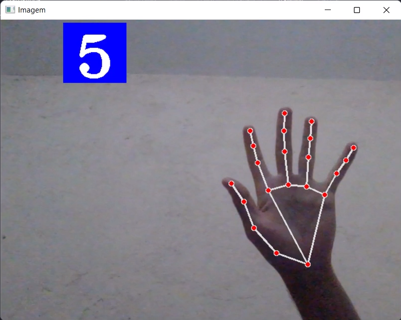

# IA com Python - Detecção da presença de mãos

Este projeto consiste em uma inteligência artificial para detecção das mãos desenvolvida em Python.\
E o objetivo desse projeto é fazer a IA conseguir contar quantos dedos estão levantados.

## Veja a imagem de exemplo:
<br>

|Ilustração|
|---|
|
---

## 🚀 Começando

Primeiro visualizar o projeto funcionando, primeiro clone o repositório para sua máquina com o seguinte comando:

```
$ git clone https://github.com/Vinicius-Rubia/IA-Hands.git
```

## ⚙️ Executando a aplicação

Para iniciar a aplicação você primeiro precisa baixar as dependências. Então em seu terminal execute:

```
$ pip install opencv-python
```
```
$ pip install mediapipe
```

Depois de instalar você pode executar `python main.py` que ira inicializar a aplicação.

- <strong>É importante que tenha um WebCam pra funcionar, pode ser um normal avulsa ou a do notebook </strong>
---

## 😎 Como funciona

- Logo que executar irá abrir a sua câmera, depois disso o prorama irá interpretar apenas uma das mãos, que no caso do projeto é a mão esquerda;

- Então você abaixando os dedos ele ira enteder como 0, levantando como 1;

- No caso do "dedão", virado pra fora é aberto e virado pra dentro é fechado;

---
⌨️ com ❤️ por [Vinicius Rubia](https://github.com/Vinicius-Rubia) 😊